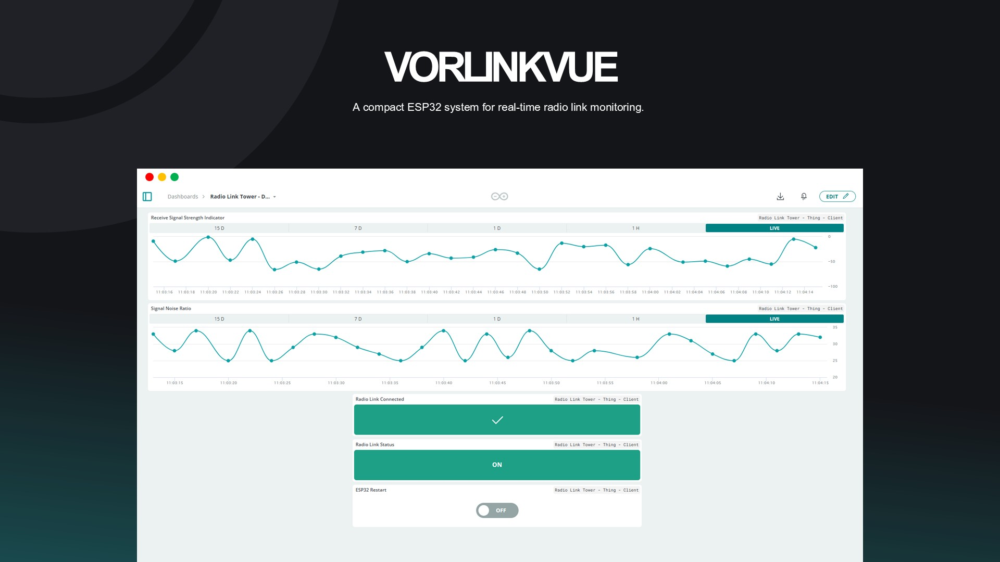

# 🖧 Sistem Monitoring Kualitas Radio Link Berbasis ESP32

## Deskripsi proyek
Proyek ini bertujuan untuk memantau kualitas radio link secara real-time dengan menggunakan dua buah ESP32. Sistem ini mengukur parameter RSSI berdasarkan standar TIPHON dan Access Point Name untuk mengklasifikasikan kualitas koneksi radio link, serta memantau beberapa parameter lainnya seperti SNR melalui protokol SNMP. Selain menampilkan data ke Arduino IoT Cloud, sistem juga mengirimkan notifikasi email dan mencatat data ke dalam Google Spreadsheet sebagai log historis.

## 🔌 Hardware yang Digunakan
- 3x ESP32 Devkit V1
- 1x W5500 Lite Ethernet Module
- 1x Power Supply 5V 3A DC
  
## 💻 Software yang Digunakan
- Arduino IDE
- Arduino IOT Cloud
- Email
- Google Spreadsheet
- Google Apps Script

## ⚙️ Konfigurasi Pin
| W5500 Lite | ESP32 #2 | ESP32 #3 |
|:----------:|:--------:|:--------:|
|    INT     |   13     |    -     |
|    CS      |   14     |    -     |
|    SCK     |   27     |    -     |
|   MOSI     |   26     |    -     |
|   MISO     |   25     |    -     |
|    RST     |   33     |    -     |
|   VCC      |  3.3V    |    -     |
|   GND      |  GND     |    -     |
|     -      |  TX2     |  RX2     |
|     -      |  RX2     |  TX2     |

## 📘 Skematik Rangkaian


## 🔁 Flowchart Sistem


## 📊 Parameter yang Dimonitor
- RSSI (Received Signal Strength Indicator)
- SNR (Signal-to-Noise Ratio)
- Access Point Name
- Jarak
- Frekuensi
- Daya Pancar
- Gain Antena

## 📶 Klasifikasi RSSI berdasarkan standar TIPHON

| Kategori    | Nilai RSSI (dBm)     |
| :---:       | :---:                |
| Sangat Baik | > -70                |
| Baik        | -70 s/d -85          |
| Cukup       | -86 s/d -100         |
| Buruk       | < -100               |
| Terputus    | AP Name Tidak Sesuai |

⚠️ Catatan: Standar [TIPHON](https://www.researchgate.net/figure/Signal-Strength-Standard-according-to-TIPHON_tbl1_378192827) secara resmi hanya mengklasifikasikan hingga kategori Buruk. Kategori Terputus pada tabel ini merupakan penyesuaian khusus proyek ini untuk mendeteksi kondisi saat access point name perangkat tidak sesuai.

## 🔧 Pembagian Tugas ESP32
Sistem ini terdiri dari tiga buah ESP32 yang memiliki fungsi dan tanggung jawab berbeda, berikut rinciannya.

### 📡 ESP32 #1 – Radio Link Simulator Unit

- Bertugas sebagai SNMP agent yang Menyediakan data parameter radio link secara dinamis melalui protokol SNMP untuk diakses oleh ESP32 #2 selaku SNMP client.
- Terintegrasi dengan Arduino IoT Cloud untuk memungkinkan pengaturan keluaran nilai parameter SNMP secara fleksibel.

### 📟 ESP32 #2 – Monitoring Unit

- Melakukan ping secara periodik ke radio link.
- Mengambil data-data parameter menggunakan protokol SNMP.
- Mengklasifikasikan kualitas sinyal berdasarkan standar TIPHON.
- Mengirimkan seluruh data hasil analisis ke ESP32 #3 melalui UART.

### 🌐 ESP32 #3 – IoT Gateway & Reporting Unit

- Menerima data dari ESP32 #2 via UART
- Mengirimkan data RSSI, SNR, status koneksi radio link, status perangkat radio link dan opsi restart sistem monitoring ke Arduino IOT Cloud.
- Mengirimkan notifikasi email ketika terjadi perubahan status kategori.
- Menyimpan log seluruh data parameter ke Google Spreadsheet.

## 🚀 Memulai Proyek

### 1. Clone Repository

```bash
git clone https://github.com/muhammadghalib/Sistem-Monitoring-Kualitas-Radio-Link-Berbasis-ESP32.git
```

### 2. Install Library

Buka file txt yang ada di direktori `arduino-libraries/` pada repository ini dan download semua librarynya ke dalam folder **libraries Arduino** di perangkat Anda.

## 3. Menjalankan ESP32 #1 - Radio Link Simulator Unit

### 3.1 Buat Variabel di Arduino IoT Cloud

Masuk ke halaman **Things** dan pada bagian **Cloud Variables**, klik **Add** dan tambahkan variabel berikut:

| Name              | Data Type | Permission     | Update Policy |
|-------------------|-----------|----------------|----------------|
| koneksiSangatBaik | Boolean   | Read & Write   | On Change      |
| koneksiBaik       | Boolean   | Read & Write   | On Change      |
| koneksiCukup      | Boolean   | Read & Write   | On Change      |
| koneksiBuruk      | Boolean   | Read & Write   | On Change      |
| koneksiTerputus   | Boolean   | Read & Write   | On Change      |

### 3.2 Setup Device ESP32

1. Pada panel kanan **Associated Device**, klik **Select Device** → **Setup New Device**.
2. Pilih **Third Party Device** → `ESP32`.
3. Pada bagian **Select Model**, pilih `DOIT ESP32 DEVKIT V1`.
4. Simpan file PDF yang berisi **Device ID** dan **Secret Key**.

### 3.3 Konfigurasi Jaringan

- Masuk ke bagian **Network**, klik **Configure**
- Isi kolom berikut:
  - `WiFi Name`
  - `WiFi Password`
  - `Secret Key` dari file PDF tadi

### 3.4 Salin Konfigurasi ke Sketch

- Buka file `thingProperties.h` pada sketch Arduino IOT Cloud.
- Salin nilai `DEVICE_LOGIN_NAME`, `SSID`, `PASS`, dan `DEVICE_KEY` ke dalam file:
  ```
  thingPropertiesVorlinkvueDeveloper.h
  ```

### 3.5 Buat Dashboard Arduino IoT Cloud

1. Buat dashboard baru di Arduino IoT Cloud.
2. Tambahkan **Switch** untuk masing-masing opsi kualitas koneksi.
3. Hubungkan setiap variabel ke masing-masing widgets.

### 3.6 Menyiapkan dan Mengunggah Sketch

1. Buka file berikut di Arduino IDE atau editor yang Anda gunakan:  
    ```bash
    esp32_unit_1_radio_link_simulator_unit.ino
    ```
2. Sesuaikan konfigurasi berikut pada baris kode:
    - **Baris ke-21**: Masukkan alamat IP yang akan digunakan, contoh :
      ```c++
      IPAddress localIP (192, 168, 0, 111);
      ```
    - **Baris ke-22**: Masukkan alamat IP gateway yang akan digunakan, contoh :
      ```c++
      IPAddress gateway (192, 168, 0, 1);
      ```
3. Setelah semua konfigurasi selesai, sambungkan ESP32 ke komputer dan unggah sketch ke perangkat.

### 3.7 Tampilan Serial Monitor


### 3.8 Tampilan Dashboard Arduino IOT Cloud


## 4 Menjalankan ESP32 #2 - Monitoring Unit

### 4.1 Hubungkan Perangkat

- Hubungkan **ESP32** dengan **modul W5500 Lite**
- Hubungkan kabel **Ethernet/LAN** ke port W5500 dan pastikan terhubung ke jaringan lokal
- Hubungkan ESP32 #2 dan ESP32 #3 sesuai dengan skematik rangkaian.

### 4.2 Menyiapkan dan Mengunggah Sketch

1. Buka file berikut di Arduino IDE atau editor yang Anda gunakan:  
    ```bash
    esp32_unit_2_monitoring_unit.ino
    ```
2. Sesuaikan konfigurasi berikut pada baris kode:
    - **Baris ke-32**: Masukkan alamat IP yang akan digunakan, contoh :
      ```c++
      const IPAddress localIP (192, 168, 0, 250);
      ```
    - **Baris ke-33**: Masukkan alamat IP gateway yang akan digunakan, contoh :
      ```c++
      const IPAddress gateway (192, 168, 0, 1);
      ```
    - **Baris ke-38**: Masukkan alamat IP yang digunakan oleh Radio Link/Radio Link Simulator, contoh :
      ```c++
      const IPAddress radioLinkTower (192, 168, 0, 111);
      ```
3. Setelah semua konfigurasi selesai, sambungkan ESP32 ke komputer dan unggah sketch ke perangkat.

### 4.3 Tampilan Serial Monitor


## 5 Menjalankan ESP32 #3 - IoT Gateway & Reporting Unit

### 5.1 Buat Variabel di Arduino IoT Cloud

Masuk ke halaman **Things** dan pada bagian **Cloud Variables**, klik **Add** dan tambahkan variabel berikut:

| Name               | Data Type | Permission     | Update Policy  |
|--------------------|-----------|----------------|----------------|
| espRestart         | Boolean   | Read & Write   | On Change      |
| radioLinkConnected | Boolean   | Read Only      | On Change      |
| radioLinkReachable | Boolean   | Read Only      | On Change      |
| rssiValue          | Integer   | Read Only      | On Change      |
| snrValue           | Integer   | Read Only      | On Change      |

### 5.2 Setup Device ESP32

1. Pada panel kanan **Associated Device**, klik **Select Device** → **Setup New Device**.
2. Pilih **Third Party Device** → `ESP32`.
3. Pada bagian **Select Model**, pilih `DOIT ESP32 DEVKIT V1`.
4. Simpan file PDF yang berisi **Device ID** dan **Secret Key**.

### 5.3 Konfigurasi Jaringan

- Masuk ke bagian **Network**, klik **Configure**
- Isi kolom berikut:
  - `WiFi Name`
  - `WiFi Password`
  - `Secret Key` dari file PDF tadi

### 5.4 Salin Konfigurasi ke Sketch

- Buka file `thingProperties.h` pada sketch Arduino IOT Cloud.
- Salin nilai `DEVICE_LOGIN_NAME`, `SSID`, `PASS`, dan `DEVICE_KEY` ke dalam file:
  ```
  thingPropertiesVorlinkvue.h
  ```

### 5.5 Buat Dashboard Arduino IoT Cloud

1. Buat dashboard baru di Arduino IoT Cloud.
2. Tambahkan widgets **2 Chart** untuk grafik nilai RSSI dan SNR, **2 Status** untuk status radio link dan **1 Button** untuk opsi restart ESP32 #3.
3. Hubungkan setiap variabel cloud ke masing-masing widgets.

### 5.6 Membuat Tabel Spreadsheet

1. Buka Google Spreadsheet dan buat file baru.  
2. Beri nama **`Radio Link Tower - Log`**.  
3. Buat tabel sesuai contoh berikut:  

   

### 5.7 Konfigurasi *Extensions* Spreadsheet

1. Klik menu **Extensions**.  
2. Pilih **Apps Script**.  
3. Beri nama proyek **`Radio Link Tower - Apps Script`**.  
4. Buka file **`script.gs`** pada folder **tools → google_apps_script** di repository ini.  
5. Salin seluruh kode dari file tersebut, lalu tempelkan pada editor *Apps Script*.  
6. Tekan **CTRL + S** untuk menyimpan.  
7. Klik **Deploy** → **Manage Deployment**.  
8. Klik **Create Deployment**.  
9. Pada ikon *gear*, pilih **Web App**.  
10. Pada bagian *Who has access*, pilih **Anyone with Google account**.  
11. Klik **Deploy**.  
12. Salin URL *Web App* yang muncul, lalu simpan untuk digunakan pada tahap selanjutnya.  

---

### 5.8 Menyiapkan dan Mengunggah Sketch

1. Buka file berikut di Arduino IDE atau editor yang Anda gunakan:  
    ```bash
    esp32_unit_3_iot_gateway_and_reporting_unit.ino
    ``` 
2. Sesuaikan konfigurasi berikut pada baris kode:
    - **Baris ke-22**: Masukkan alamat email pengirim, contoh :
      ```c++
      #define AUTHOR_EMAIL "john@gmail.com"
      ```
    - **Baris ke-23**: Masukkan 16 digit Author Password dari akun Google pengirim, contoh :
      ```c++
      #define AUTHOR_PASSWORD "aaaa bbbb cccc dddd"
      ```
    - **Baris ke-24**: Masukkan alamat email penerima, contoh :
      ```c++
      #define RECIPIENT_EMAIL "michael@gmail.com"
      ```
    - **Baris ke-42**: Masukkan URL Web App yang diperoleh pada langkah 5.7, contoh :
      ```c++
      #define GOOGLE_WEB_APP_URL "https://script.google.com/macros/s/xxxxx/exec"
      ```
3. Setelah semua konfigurasi selesai, sambungkan ESP32 ke komputer dan unggah sketch ke perangkat.

### 5.9 Tampilan Serial Monitor


### 5.10 Tampilan Dashboard Arduino IOT Cloud

- Saat koneksi sangat baik
  
- Saat koneksi terputus
  

### 5.11 Tampilan Email

- Saat koneksi terhubung
  
- Saat koneksi terputus
  

### 5.12 Tampilan Spreadsheet


## 📝 Catatan Penting 
1. Apabila ingin memonitor radio link asli (bukan menggunakan ESP32 radio link simulator), pastikan Anda mengetahui alamat IP dan OID yang digunakan oleh perangkat radio link tersebut, lalu masukkan alamat IP dan OID tersebut ke dalam source code ESP32 #2.
2. Beberapa library telah dimodifikasi secara khusus untuk mendukung fitur-fitur proyek ini. Untuk memastikan kompatibilitas dan kinerja optimal, gunakan hanya library yang telah disediakan.


## 📸 Dokumentasi


## 💡 STAY CURIOUS
